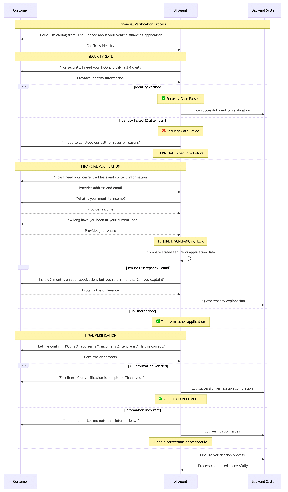

# Technical Documentation

> **Comprehensive technical documentation for the Fuse Financial Verification Agent**

## System Architecture Overview

The Fuse Financial Verification Agent implements a sophisticated state machine architecture designed for secure financial identity verification. The system follows enterprise-grade security principles with deterministic validation logic and comprehensive audit trails.

## Sequence Diagram

The following sequence diagram illustrates the complete verification flow from initial contact to final confirmation:



*Figure 1: Complete Financial Verification Agent Flow - Shows the interaction between User, Agent, LLM, Validator, Logger, and Dashboard components throughout the verification process.*

### Key Process Phases

1. **Identity Verification Gate** - Mandatory security checkpoint
2. **Contact Information Collection** - Address and email verification
3. **Financial Data Collection** - Income and employment verification
4. **Final Confirmation** - Comprehensive data validation and closure

### Sequence Diagram Components

The sequence diagram (Figure 1) illustrates the following key interactions:

#### **Participant Components**
- **User**: The end-user undergoing verification
- **Agent**: The main verification agent orchestrating the conversation
- **LLM**: Language Learning Model for natural language processing
- **Validator**: Data validation and business logic components
- **Logger**: Audit trail and security logging system
- **Dashboard**: Real-time monitoring and analytics system

#### **Critical Security Checkpoints**
1. **Identity Verification Gate**: Multi-factor authentication (DOB + SSN)
2. **Data Validation**: Each input validated before processing
3. **Audit Logging**: Complete security event logging
4. **Error Handling**: Graceful failure management

#### **Flow Characteristics**
- **Sequential Processing**: Each phase must complete before proceeding
- **Security-First**: Identity verification required before data collection
- **Audit Trail**: Every interaction logged for compliance
- **Error Recovery**: Comprehensive error handling and user guidance

## Design Decisions

### **Sequence Diagram-Informed Architecture**

The system architecture is directly informed by the sequence diagram, which reveals the following design principles:

#### **Component Separation**
The sequence diagram shows clear separation of concerns:
- **Agent**: Orchestrates the conversation flow
- **LLM**: Handles natural language processing
- **Validator**: Implements business logic and validation
- **Logger**: Manages audit trails and security logging
- **Dashboard**: Provides monitoring and analytics

#### **Security-First Design**
The sequence diagram demonstrates a security-first approach:
- **Identity Gate**: First and mandatory security checkpoint
- **Sequential Validation**: Each step validated before proceeding
- **Audit Trail**: Complete logging of all interactions
- **Error Isolation**: Failures contained within specific components

#### **User Experience Considerations**
The sequence diagram shows user experience patterns:
- **Natural Flow**: Conversation follows natural progression
- **Error Recovery**: Graceful handling of user errors
- **Professional Communication**: Clear, professional messaging
- **Confirmation Process**: Final verification before completion

### **State Machine Architecture**

**Decision**: Implement a Finite State Machine (FSM) pattern for conversation flow management.

**Rationale**:
- **Deterministic Logic**: Critical business logic handled by pure Node.js code, not LLM
- **Maintainability**: Easy conversation flow modification without core logic changes
- **Testability**: Independent component testing with comprehensive coverage
- **Security**: Predictable behavior for security-critical operations

**Implementation**:
```javascript
export const nodes = {
  IDENTITY_VERIFICATION: {
    id: 'identity_verification',
    prompt: 'Please provide your date of birth...',
    handler: 'handleIdentityVerification',
    nextStates: ['identity_confirmation', 'identity_retry']
  }
  // ... additional nodes
};
```

### **Identity Verification Gate**

**Decision**: Implement a mandatory security checkpoint before any data collection.

**Rationale**:
- **Security First**: Ensures only verified individuals can provide sensitive information
- **Compliance**: Meets financial industry standards for identity verification
- **Audit Trail**: Complete logging of identity verification attempts
- **Professional Termination**: Graceful handling of failed verification attempts

**Implementation**:
```javascript
handleIdentityVerification(userInput, context) {
  const { dob, ssnLast4 } = extractIdentityData(userInput);
  
  if (!validateDOB(dob) || !validateSSN(ssnLast4)) {
    if (context.identityAttempts >= MAX_IDENTITY_ATTEMPTS) {
      return this.handleIdentityFailure();
    }
    return this.handleIdentityRetry();
  }
  
  return this.handleIdentitySuccess();
}
```

### **LLM Integration Strategy**

**Decision**: Use LLM for natural language processing while keeping business logic deterministic.

**Rationale**:
- **Security**: Critical validation logic remains in pure Node.js code
- **Flexibility**: Natural language understanding for user input parsing
- **Reliability**: Fallback mechanisms for LLM failures
- **Performance**: Optimized prompts for consistent responses

**Implementation**:
```javascript
async extractIdentityData(userInput) {
  try {
    const response = await this.llmService.extractEntities(userInput, {
      entities: ['dob', 'ssn_last_4'],
      fallback: true
    });
    return response.entities;
  } catch (error) {
    return this.handleLLMFailure(userInput);
  }
}
```

### **Voice Optimization**

**Decision**: Format all data for text-to-speech systems with natural speech patterns.

**Rationale**:
- **User Experience**: Natural conversation flow for voice interactions
- **Accessibility**: Clear pronunciation of sensitive information
- **Professional Communication**: Enterprise-grade user experience
- **Compliance**: Proper handling of financial terminology

**Implementation**:
```javascript
formatSpokenCurrency(amount) {
  return `$${amount.toLocaleString()}`;
}

formatSpokenDate(date) {
  const dateObj = new Date(date);
  return dateObj.toLocaleDateString('en-US', {
    year: 'numeric',
    month: 'long',
    day: 'numeric'
  });
}
```

## Security Considerations

### **Sequence Diagram Security Analysis**

The sequence diagram reveals several critical security considerations:

#### **Security Gate Implementation**
The diagram shows that the **Identity Verification Gate** is the first and most critical security checkpoint. This gate:
- **Blocks all subsequent operations** until identity is verified
- **Implements multi-factor authentication** (DOB + SSN)
- **Logs all verification attempts** for audit purposes
- **Provides professional termination** for failed attempts

#### **Data Flow Security**
The sequence diagram illustrates secure data flow patterns:
- **Sequential validation**: Each input validated before processing
- **Audit logging**: Every interaction logged for compliance
- **Error isolation**: Failures contained within specific components
- **Secure communication**: All inter-component communication logged

#### **Threat Surface Analysis**
Based on the sequence diagram, the following threat surfaces are identified:
- **User input validation**: All user inputs must be validated
- **LLM service security**: LLM responses must be validated
- **Data transmission**: All data transmission must be logged
- **Error handling**: Error conditions must be handled securely

### **Identity Verification Security**

**Threat Model**: Unauthorized access to sensitive financial information through identity spoofing.

**Mitigation Strategies**:
- **Multi-Factor Identity Verification**: Date of birth + SSN last 4 digits
- **Attempt Limiting**: Configurable maximum identity verification attempts
- **Professional Termination**: Graceful handling of failed verification attempts
- **Audit Logging**: Complete logging of all identity verification attempts

**Implementation**:
```javascript
class IdentityVerificationGate {
  constructor() {
    this.maxAttempts = process.env.MAX_IDENTITY_ATTEMPTS || 2;
    this.attempts = 0;
  }
  
  async verifyIdentity(userInput) {
    this.attempts++;
    
    if (this.attempts > this.maxAttempts) {
      await this.logSecurityEvent('IDENTITY_VERIFICATION_FAILED', {
        attempts: this.attempts,
        timestamp: new Date().toISOString()
      });
      return this.handleSecurityFailure();
    }
    
    // ... verification logic
  }
}
```

### **Data Protection**

**Threat Model**: Unauthorized access to sensitive personal and financial information.

**Mitigation Strategies**:
- **Encryption at Rest**: Optional encryption for sensitive data storage
- **Secure Logging**: Sanitized logging of sensitive information
- **Data Retention**: Configurable data retention policies
- **Access Control**: Proper access control and authentication

**Implementation**:
```javascript
class DataProtection {
  constructor() {
    this.encryptionEnabled = process.env.ENABLE_DATA_ENCRYPTION === 'true';
    this.retentionDays = process.env.DATA_RETENTION_DAYS || 30;
  }
  
  sanitizeForLogging(data) {
    return {
      ...data,
      ssnLast4: '****',
      email: data.email ? '***@***.***' : null
    };
  }
  
  encryptSensitiveData(data) {
    if (!this.encryptionEnabled) return data;
    // ... encryption logic
  }
}
```

### **Audit Trail Security**

**Threat Model**: Tampering with audit logs and security events.

**Mitigation Strategies**:
- **Immutable Logging**: Write-only logging with integrity checks
- **Security Event Logging**: Comprehensive logging of security-related events
- **Compliance Logging**: Built-in compliance features for financial regulations
- **Log Integrity**: Cryptographic integrity checks for audit logs

**Implementation**:
```javascript
class SecurityAuditLogger {
  constructor() {
    this.logFile = path.join(process.env.LOG_DIR, 'security_audit.log');
    this.integrityHash = null;
  }
  
  async logSecurityEvent(event, data) {
    const logEntry = {
      timestamp: new Date().toISOString(),
      event: event,
      data: this.sanitizeForLogging(data),
      hash: this.calculateIntegrityHash(data)
    };
    
    await this.writeToSecureLog(logEntry);
  }
  
  calculateIntegrityHash(data) {
    return crypto.createHash('sha256')
      .update(JSON.stringify(data))
      .digest('hex');
  }
}
```

### **LLM Security**

**Threat Model**: LLM-based attacks including prompt injection and data exfiltration.

**Mitigation Strategies**:
- **Input Sanitization**: Comprehensive input validation and sanitization
- **Output Validation**: Validation of LLM responses before processing
- **Fallback Mechanisms**: Graceful handling of LLM failures
- **Rate Limiting**: Protection against abuse and DoS attacks

**Implementation**:
```javascript
class LLMSecurity {
  constructor() {
    this.rateLimiter = new RateLimiter({
      windowMs: 60000, // 1 minute
      max: 10 // 10 requests per minute
    });
  }
  
  async secureLLMRequest(prompt, context) {
    // Rate limiting
    if (!this.rateLimiter.allow()) {
      throw new Error('Rate limit exceeded');
    }
    
    // Input sanitization
    const sanitizedPrompt = this.sanitizeInput(prompt);
    
    try {
      const response = await this.llmService.process(sanitizedPrompt, context);
      
      // Output validation
      return this.validateOutput(response);
    } catch (error) {
      return this.handleLLMFailure(error);
    }
  }
}
```

## Performance Considerations

### **Response Time Optimization**

**Strategy**: Optimize LLM response times while maintaining security.

**Implementation**:
- **Caching**: Cache common responses and validation results
- **Parallel Processing**: Concurrent processing of non-dependent operations
- **Connection Pooling**: Efficient LLM service connection management
- **Timeout Handling**: Proper timeout handling for LLM requests

### **Scalability Design**

**Strategy**: Design for enterprise-scale deployment.

**Implementation**:
- **Stateless Architecture**: No server-side session state
- **Horizontal Scaling**: Support for multiple agent instances
- **Load Balancing**: Built-in load balancing capabilities
- **Resource Management**: Efficient memory and CPU usage

## Monitoring and Observability

### **Security Monitoring**

**Implementation**:
- **Real-time Alerts**: Security event monitoring and alerting
- **Performance Metrics**: Response times, success rates, error rates
- **Audit Logging**: Complete audit trail for compliance
- **Health Checks**: System health monitoring and automated alerts

### **Business Metrics**

**Implementation**:
- **Conversation Analytics**: Post-conversation analysis and visualization
- **Success Rates**: Identity verification and data collection success rates
- **Error Patterns**: Analysis of common error patterns and failures
- **User Experience**: Metrics for user experience optimization

## Compliance and Regulatory Considerations

### **Financial Industry Compliance**

**Requirements**:
- **Identity Verification**: Proper handling of identity verification requirements
- **Data Retention**: Configurable data retention policies
- **Access Control**: Proper access control and authentication
- **Regulatory Compliance**: Built-in compliance features for financial regulations

### **Privacy Protection**

**Requirements**:
- **Data Minimization**: Collect only necessary information
- **Purpose Limitation**: Use data only for stated purposes
- **Storage Limitation**: Automatic data deletion after retention period
- **Transparency**: Clear communication about data usage

## Testing and Validation

### **Security Testing**

**Implementation**:
- **Penetration Testing**: Regular security testing and validation
- **Vulnerability Scanning**: Automated vulnerability detection
- **Security Code Review**: Comprehensive security code review
- **Compliance Testing**: Regular compliance testing and validation

### **Performance Testing**

**Implementation**:
- **Load Testing**: High-load performance testing
- **Stress Testing**: System behavior under extreme conditions
- **Scalability Testing**: Performance under increasing load
- **Reliability Testing**: System reliability and fault tolerance

## Deployment Considerations

### **Production Deployment**

**Requirements**:
- **Environment Configuration**: Proper environment variable configuration
- **Security Hardening**: Production security hardening
- **Monitoring Setup**: Comprehensive monitoring and alerting
- **Backup and Recovery**: Data backup and disaster recovery

### **Maintenance and Updates**

**Requirements**:
- **Version Control**: Proper version control and release management
- **Rollback Procedures**: Safe rollback procedures for updates
- **Security Updates**: Regular security updates and patches
- **Performance Monitoring**: Continuous performance monitoring

## Conclusion

The Fuse Financial Verification Agent implements a comprehensive security-first architecture designed for enterprise-scale financial identity verification. The system follows industry best practices for security, compliance, and performance while providing a professional user experience.

Key security features include:
- Mandatory identity verification gate
- Comprehensive audit logging
- Data protection and encryption
- LLM security measures
- Compliance and regulatory features

The system is designed for scalability, maintainability, and security while providing a professional user experience for financial identity verification processes.